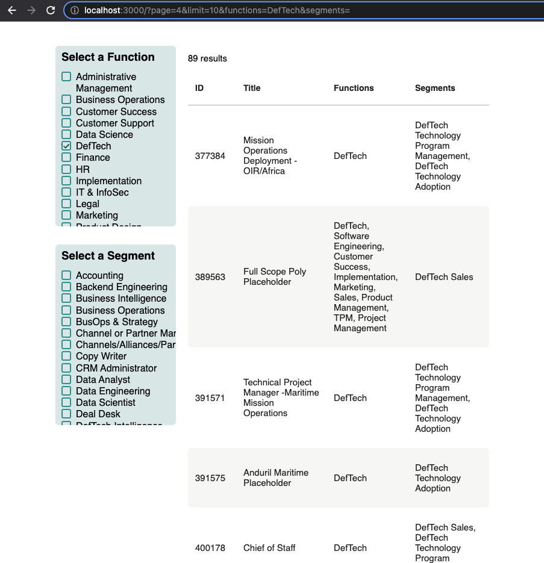

# Table Pagination & Filters via URL Params

The goal of this take home assessment is to finish the setup of pagination and filtering for a table. You must use URL query parameters to store state.

### Definitions

- Page: the current page the table is on
- Limit: the number of rows per page to display

### Requirements

- You create a custom hook to handle the table logic (page, limit, data, etc).
- You use URL Query Parameters to preserve state (purpose: you could send the URL to someone and the table loads the data according to specified query parameters)
- You can navigate forward and backward in history and the table loads accordingly
- Adding/Removing a filter sets you back to page 1

### Nice to Haves

- Logic to handle multiple tables on page
- Prettier UI

### The Existing Components

#### FilterBox

The FilterBox component displays a list of filters that can be toggled via a checkbox.

| Prop              | Type       | Description                                                                                        |
| :---------------- | :--------- | :------------------------------------------------------------------------------------------------- |
| `label`           | `string`   | **Required**. The name to display for this filter box.                                             |
| `id`              | `string`   | **Required**. A unique id for this filter box.                                                     |
| `handleFilter`    | `func`     | **Required**. A function that handles storing the state of this filter.                            |
| `options`         | `string[]` | **Required**. A string array of options (ex: `["Software Engineering", "Customer Success"]`).      |
| `selectedOptions` | `string[]` | **Required**. A string array of actively selected options (ex: `["Finance", "Customer Success"]`). |

#### Pagination

The pagination component displays controls for moving backward and forward between pages, as well as page numbers to jump to.

| Prop           | Type     | Description                                                                     |
| :------------- | :------- | :------------------------------------------------------------------------------ |
| `total`        | `number` | **Required**. The total number of results in the data.                          |
| `limit`        | `number` | **Required**. The number of results to show per page.                           |
| `onChangePage` | `func`   | **Required**. A functon that handles changing the page of the associated table. |
| `currentPage`  | `number` | **Required**. The current page.                                                 |

#### Table

The table component displays a table using `react-data-table-component`.

| Prop              | Type      | Description                                                       |
| :---------------- | :-------- | :---------------------------------------------------------------- |
| `columns`         | `array`   | **Required**. An array of columns to use for displaying the data. |
| `total`           | `number`  | The total number of results in the data.                          |
| `data`            | `array`   | An array of data to display.                                      |
| `progressPending` | `boolean` | A boolean indicating if the table is loading.                     |
